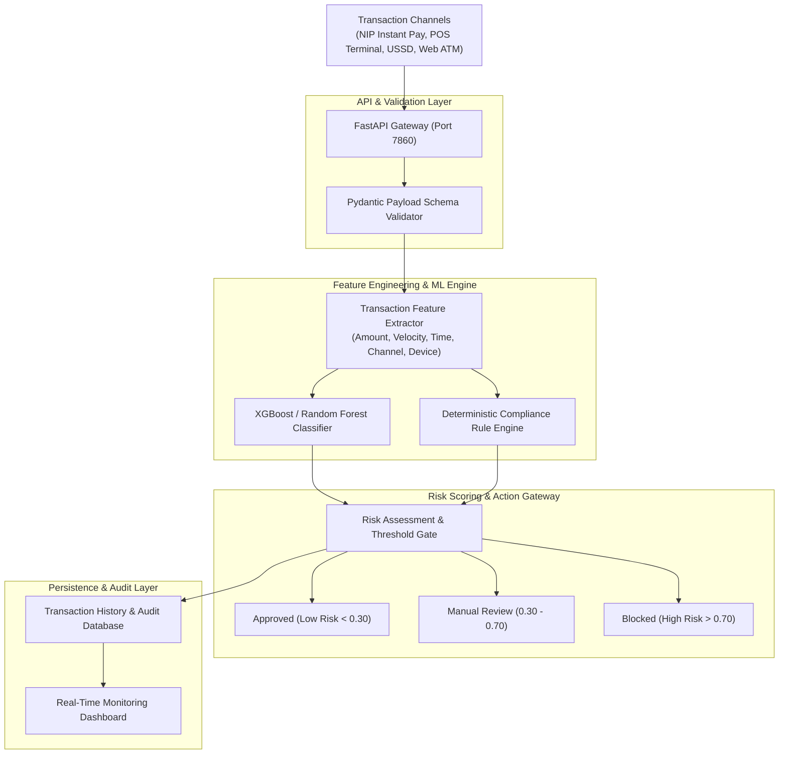

<div align="center">

# Gojo Sentinel
### Real-Time AI Fraud Detection & Risk Scoring Engine

*A machine learning-driven fraud prevention system tailored for Nigerian financial transactions (NIP, POS, USSD, and Web ATM).*

[](https://python.org)
[](https://fastapi.tiangolo.com)
[](https://scikit-learn.org)
[](https://xgboost.ai)
[](https://docker.com)
[](LICENSE)

---

**Gojo Sentinel** is an AI-powered transaction fraud detection platform engineered specifically for the Nigerian fintech ecosystem. It evaluates financial transactions across multi-channel endpoints in sub-second latency, combining gradient-boosted decision trees (XGBoost) and custom rule engines to flag anomalies, velocity spikes, card theft, and account takeover attempts.

</div>

---

## Core Capabilities

| Capability | Description | Channel Coverage |
|---|---|---|
| **Real-Time Risk Scoring** | Sub-second inference evaluating probability of fraud ($0.00 \rightarrow 1.00$) | NIP, POS, USSD, Web ATM |
| **Velocity & Anomaly Detection** | Flags rapid bursts of high-volume transfers and impossible travel geography | Account & Device Fingerprinting |
| **Rule Engine + ML Hybrid** | Allows compliance officers to enforce hard rules alongside probabilistic ML models | Multi-Channel Gateways |
| **Admin Analytics Dashboard** | Real-time monitoring of flagged transactions, false positive tuning, and audit trails | Web Administration |
| **Mobile API Integration** | Lightweight REST payload schemas for seamless integration into Android & iOS banking apps | Core Banking & Mobile Apps |

---

## System Architecture



---

## Transaction Evaluation Matrix

| Risk Level | Score Range | Action Taken | Notification Protocol |
|---|---|---|---|
| **Low Risk** | `0.00 - 0.29` | Transaction Approved Instantly | Standard Transaction Receipt |
| **Medium Risk** | `0.30 - 0.69` | Trigger Step-Up 2FA / OTP Verification | SMS & In-App Security Prompt |
| **High Risk** | `0.70 - 1.00` | Immediate Transaction Decline & Temporary Hold | Automated Fraud Desk Alert & Push Notification |

---

## Tech Stack

### Machine Learning & Data Processing
- **Python 3.10+** — Core runtime environment
- **XGBoost & Scikit-Learn** — Supervised ensemble models for imbalanced financial datasets
- **Pandas & NumPy** — High-performance feature transformations
- **Imbalanced-Learn (SMOTE)** — Synthetic sampling for rare fraud event balancing

### Backend & API Service
- **FastAPI** — Asynchronous high-throughput REST API framework
- **Pydantic** — Strict payload validation and sanitization
- **Uvicorn** — ASGI production server
- **Docker** — Containerized deployment (Hugging Face Spaces / Cloud VM ready)

---

## Project Structure

```
Transaction-Fraud-Detector/
├── app/
│   ├── main.py                  # FastAPI application entry point
│   ├── api/                     # Transaction evaluation and rule endpoints
│   ├── core/                    # Security configurations and middleware
│   ├── models/                  # Pydantic schemas and database models
│   └── services/                # ML inference pipeline and rule evaluators
├── ml/
│   ├── train.py                 # Model training and hyperparameter tuning script
│   ├── evaluate.py              # Confusion matrix, ROC-AUC, and precision-recall metrics
│   └── saved_models/            # Serialized XGBoost model artifacts (.joblib / .json)
├── static/                      # Admin dashboard web interface
├── doc/                         # Architectural diagrams and offline usage manuals
├── Dockerfile                   # Production container definition
├── requirements.txt             # Python dependencies
└── README.md                    # Project documentation
```

---

## Getting Started

### Prerequisites
- Python 3.10 or higher
- Git

### Local Installation

1. **Clone the repository:**
   ```bash
   git clone https://github.com/SageerAuwal/Transaction-Fraud-Detector.git
   cd Transaction-Fraud-Detector
   ```

2. **Create and activate a virtual environment:**
   ```bash
   python -m venv venv

   # Windows
   venv\Scripts\activate

   # Linux/macOS
   source venv/bin/activate
   ```

3. **Install dependencies:**
   ```bash
   pip install -r requirements.txt
   ```

4. **Start the API server:**
   ```bash
   uvicorn app.main:app --host 0.0.0.0 --port 7860 --reload
   ```

5. **Access the Application:**
   - **Dashboard & API:** `http://localhost:7860`
   - **Interactive API Docs:** `http://localhost:7860/docs`

---

## Docker Deployment

To run the containerized application:

```bash
# Build the Docker image
docker build -t gojo-sentinel .

# Run the container on port 7860
docker run -p 7860:7860 gojo-sentinel
```

---

## Author

**Sageer Auwal**  
Federal University of Kashef, Gombe State  
Faculty of Science and Computer Science  

---

## License

This project is **proprietary software**. All rights reserved.

Copyright (c) 2026 Sageer Auwal. All rights reserved.

---

<div align="center">

**Securing digital finance with intelligent transaction defense**  
*Gojo Sentinel — AI Fraud Detection for Nigerian Fintech*

</div>
